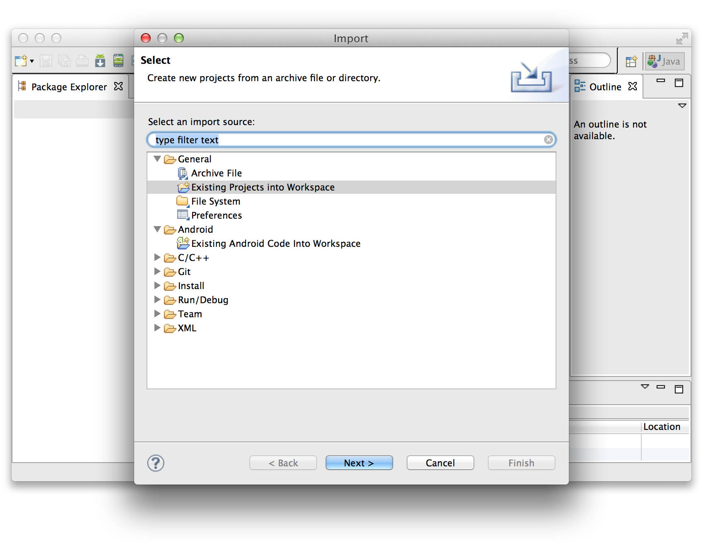
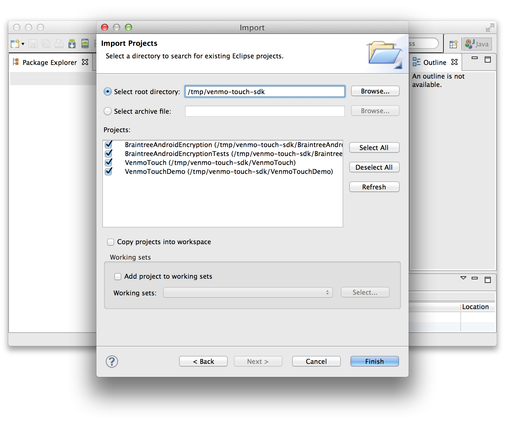
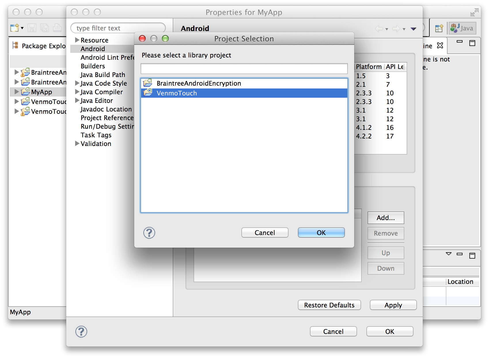
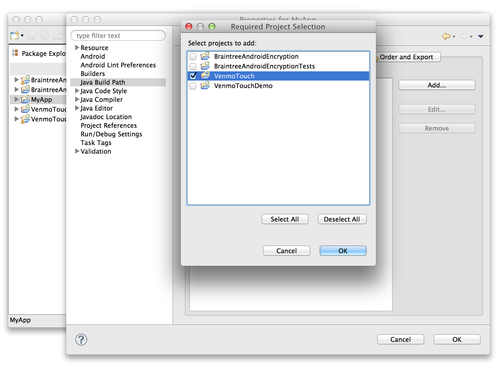
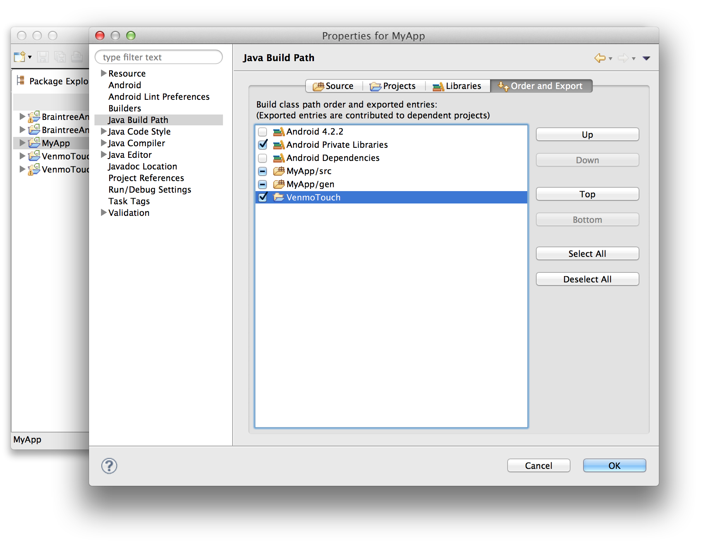

# Venmo Touch for Android

## Release Notes

**Version**: 1.0.0 beta 2 (August 15 2013).  Confidential.

**Known Issues**

* **Beta release.**  Please do not release applications using this SDK outside
  of your own internal/trusted tester pool.
* **Verbose logging.**  Extra logging is enabled for beta users.


## 1. Overview

This is the Venmo Touch Android SDK.  Inside, you'll find:

* A simple Activity your app can launch to collect payment information.
* Custom Views you can integrate with your own Activity to use Venmo Touch payment information.
* Classes for identifying credit card types and validating account numbers.

## 2. Installing the SDK

The Venmo Touch SDK is distributed as an Android [library project](http://developer.android.com/tools/projects/projects-eclipse.html#ReferencingLibraryProject).  Though
these instructions are tailored to Eclipse users, integration with Ant should
be possible as well.

### 2.1 Download and Import

Download the latest SDK release (TODO: link).

Open your application in Eclipse.  Select *File* ⇾ *Import*, then under *General* select *Existing Projects Into Workspace* and click *Next*.



In the next window, click *Browse* and navigate to the root directory of the SDK.

Once selected, you should see a list of projects:



* **VenmoTouch**: The main Venmo Touch SDK. Required.
* **BraintreeAndroidEncryption**: Encryption routines, used by **VenmoTouch**. Required.
* **BraintreeAndroidEncryptionTests**: Unittests for BraintreeAndroidEncryption. Optional.
* **VenmoTouchDemo**: Demo app which uses VenmoTouch. Optional

Be sure at least **VenmoTouch** and **BraintreeAndroidEncryption** are imported.

### 2.2 Add VenmoTouch Dependency to Your App

Your project must link to the VenmoTouch project as a dependency.  In Eclipse, this is done in two places.

Right click on your project and open *Properties*.  Navigate to the *Android* tab and look at the lower *Library* section.  Select *Add* and then add the *VenmoTouch* library from the list.

(Note that **BraintreeAndroidEncryption** is already depended on by **VenmoTouch**, so you don't need to add it here.)



Next, in the left menu, find *Java Build Path*.  Under the *Projects* tab, press *Add* and add the *VenmoTouch* project.



Finally, under the *Order and Export* tab, be certain the checkbox next to *VenmoTouch* is checked.




The SDK is now installed.  Continue to the next section to integrate Venmo Touch
with your application.

## 3. Integration Guide

This section shows you how to launch **PaymentFormActivity** to collect payment information
for your application.

*Want to integrate Venmo Touch Views within your own Activity instead? Skip to the next section, "Integration Using Custom Views".*

### 3.1 Update AndroidManifest

Your application will launch a new Activity, *PaymentFormActivity*, to collect payment
information. Like any other activity, it must be added to your manifest:

```xml
        <activity android:name="com.venmo.touch.activity.PaymentFormActivity" />
```

When another app on the device uses the Venmo Touch protocol, it may update
saved session information.  Venmo Touch needs a small BroadcastReceiver and Service
pair in order to receive these updates.  Add them to your AndroidManifest:

```xml
        <receiver
            android:name="com.venmo.touch.service.VenmoTouchUpdateReceiver"
            android:exported="true" >
            <intent-filter>
                <action android:name="com.venmo.touch.UPDATE" />
            </intent-filter>
        </receiver>
        <service android:name="com.venmo.touch.service.VenmoTouchUpdateService" />
        <meta-data android:name="venmo_touch.enabled" android:value="true" />
```

Be sure your app has the internet permission:

```xml
    <uses-permission android:name="android.permission.INTERNET" />
```

### 3.2 Launch the Payment Activity

When you are ready to collect payment information in your checkout flow,
you will launch **PaymentFormActivity**.  This standalone activity allows
the user to select a saved Venmo Touch card or enter a new card, returning
the result back to your activity.

Somewhere in your Activity, launch the payment activity using [startActivityForResult()](http://developer.android.com/reference/android/app/Activity.html#startActivityForResult%28android.content.Intent,%20int%28):

```java
import java.util.Map;

import android.app.Activity;
import android.content.Intent;
import android.os.Bundle;
import android.view.View;
import android.widget.Button;
import android.widget.TextView;

import com.venmo.touch.activity.PaymentFormActivity;
import com.venmo.touch.model.CardDetails;
import com.venmo.touch.model.CardStub;

public class MyActivity extends Activity {

    /** Request code for startActivityWithResult. */
    private static final int REQUEST_PAYMENT = 1;
    
    private static final String MERCHANT_ID = "your merchant id";
    private static final String MERCHANT_KEY = "your merchant key";
    private static final boolean USE_SANDBOX = true;

    @Override
    protected void onCreate(Bundle savedInstanceState) {
        super.onCreate(savedInstanceState);
        
        // Set up your activity as usual.
        setContentView(R.layout.my_activity);

        Button button = (Button) findViewById(R.id.show_form_button);
        button.setOnClickListener(new View.OnClickListener() {
            @Override
            public void onClick(View v) {
                final Intent intent;
                if (USE_SANDBOX) {
                    intent = PaymentFormActivity.getSandboxStartIntent(MyActivity.this, MERCHANT_ID, MERCHANT_KEY);
                } else {
                    intent = PaymentFormActivity.getStartIntent(MyActivity.this, MERCHANT_ID, MERCHANT_KEY);
                }
                startActivityForResult(intent, REQUEST_PAYMENT);
            }
        });        
    }

    // ...

}
```


### 3.3 Process the Results

When the payment Activity finishes, the Android framework will fire
[onActivityResult()](http://developer.android.com/reference/android/app/Activity.html#onActivityResult%28int,%20int,%20android.content.Intent%28) in your Activity.

To interpret results, pass the result ``data`` intent to the static method
**PaymentFormActivity.processResultIntent(..)**.  Exactly one of the
callbacks on **ActivityResultHandler** will be fired, depending on the outcome:

```java
public class MyActivity extends Activity {

    // ...

    @Override
    protected void onActivityResult(int requestCode, int resultCode, Intent data) {
        if (requestCode != REQUEST_PAYMENT) {
            super.onActivityResult(requestCode, resultCode, data);
            return;
        }

        PaymentFormActivity.processResultIntent(data, new PaymentFormActivity.ActivityResultHandler() {
            @Override
            public void onCardSelected(CardStub stub) {
                // Venmo Touch card selected.
                processVenmoTouchCard(stub);
            }

            @Override
            public void onCardAdded(CardDetails details, boolean saveToTouch,
                    Map<String, String> encryptedCardDetails) {
                // New card added.
                processNewCard(details, saveToTouch, encryptedCardDetails);
            }

            @Override
            public void onCancelled() {
                // Aborted by user.
            }
        });
    }
}
```

Your application will need to implement the methods
``processVenmoTouchCard(..)`` and ``processNewCard(..)`` to complete
checkout.

## 4. Integration Using Custom Views

*PaymentActivityForm* provides a simple all-in-one payment form, but
you may wish to build a more customized payment form.  The steps below
will show you how.

### 4.1 Update AndroidManifest

When another app on the device uses the Venmo Touch protocol, it may update
saved session information.  Venmo Touch needs a small BroadcastReceiver and Service
pair in order to receive these updates.  Add them to your AndroidManifest:

```xml
        <receiver
            android:name="com.venmo.touch.service.VenmoTouchUpdateReceiver"
            android:exported="true" >
            <intent-filter>
                <action android:name="com.venmo.touch.UPDATE" />
            </intent-filter>
        </receiver>
        <service android:name="com.venmo.touch.service.VenmoTouchUpdateService" />
        <meta-data android:name="venmo_touch.enabled" android:value="true" />
```

Note that when using this method, you do *not* need to declare the
**PaymentFormActivity** component in your manifest.

### 4.2 Add the View

In your payment activity's layout XML, you'll need to add the Venmo views.
Here's an excerpt:

```xml
<!-- Layout for MyPaymentActivity.java -->
<LinearLayout xmlns:android="http://schemas.android.com/apk/res/android"
    xmlns:tools="http://schemas.android.com/tools"
    android:layout_width="match_parent"
    android:layout_height="match_parent"
    android:orientation="vertical">

    <TextView
        android:text="My app"
        android:layout_width="match_parent"
        android:layout_height="wrap_content" />

    <!-- ... other views ... -->

    <com.venmo.touch.view.VTComboCardView
        android:id="@+id/combo_view"
        android:layout_width="match_parent"
        android:layout_height="wrap_content" />

    <!-- ... -->

</LinearLayout>
```

**VTComboCardView** combines an "add new card" form with a drop-down to select
a previously-used Venmo Touch card when available.

### 4.3 Connect Views to Venmo Touch Client

By themselves, Venmo Touch views you added to your layout won't do anything.
You need to do two more small steps in your Activity:  Create a **VenmoTouchClient**,
and bind your view to a new **VTComboCardViewController** object, which
manages all interactions between the client and the **VTComboCardView**.

```java
class MyPaymentActivity extends Activity {

    // ...

    private static final String MERCHANT_ID = "your merchant id";
    private static final String MERCHANT_SECRET = "your merchant key";

    private VenmoTouchClient mClient;
    private VTComboCardView mComboView;
    private VTComboCardViewController mComboController;

    @Override
    protected void onCreate(Bundle savedInstanceState) {
        super.onCreate(savedInstanceState);
        setContentView(R.layout.main_activity);

        mClient = VenmoTouchClient.forSandboxMerchant(this, MERCHANT_ID, MERCHANT_SECRET);
        mComboView = (VTComboCardView) findViewById(R.id.combo_view);
        mComboController = new VTComboCardViewController(this, mClient, mComboView);
    }

    @Override
    protected void onStart() {
        super.onStart();
        mClient.start();
        mComboController.onStart();
    }

    @Override
    protected void onStop() {
        super.onStop();
        mComboController.onStop();
        mClient.stop();
    }

}

```

Take note of the ``onStart()`` and ``onStop()`` methods above: Both the client
and the controller need to be notified when the enclosing Activity is
started and stopped, in order to cleanly shutdown.

### 4.4 Process the Results

Results are delivered using a **Listener** interface on the **VTComboCardViewController**.
Adjust your ``onCreate()`` method to add these callbacks:

```java
    @Override
    protected void onCreate(Bundle savedInstanceState) {
        super.onCreate(savedInstanceState);
        setContentView(R.layout.main_activity);

        mClient = VenmoTouchClient.forSandboxMerchant(this, MERCHANT_ID, MERCHANT_SECRET);
        mComboView = (VTComboCardView) findViewById(R.id.combo_view);
        mComboController = new VTComboCardViewController(this, mClient, mComboView);

        // Handle results.
        mComboController.setListener(new VTComboCardViewController.Listener() {
            @Override
            public void onCardSelected(CardStub card) {
                // A Venmo Touch card was selected.  Use it for payment.
                processVenmoTouchCard(card);
            }

            @Override
            public void onCardDetailsSubmitted(CardDetails details, boolean addToTouch,
                    Map<String, String> encryptedCardDetails) {
                // A new Card was entered.  Use it for payment.
                processNewCard(details, addToTouch, encryptedCardDetails);
            }

            @Override
            public void onCardListUpdated(List<CardStub> cards) {
               // The list of available Venmo Touch cards changed (informational).
            }
        });
    }
```

Your application will need to implement the methods
``processVenmoTouchCard(..)`` and ``processNewCard(..)`` to complete
checkout.


## 5. Sample Applications

The **VenmoTouchDemo** project contains a handful of sample Activities.

* **SimpleIntegrationActivity**: A sample using **PaymentFormActivity**, as described in Secion 3 above.
* **VenmoTouchDemoActivity**: A sample using **VTComboCardView**, as described in Secion 4 above.
* **CustomIntegrationActivity**: A sample using individual Venmo Touch views rather than **VTComboCardView**.

While running any sample, you may switch between them using the menu button.

**Tip:** Try substituting your own merchant ID and key in **DemoConfig.java**.

## 6. Reference

### 6.1 Views

The SDK includes several general-purpose Android Views, which you may
use with or without Venmo Touch:

* **AccountNumberEditText**: An *EditText* subclass which auto-detects the
card type and automatically adds separator spaces.
* **ExpirationDateEditText**: A ``MM/YY`` text entry field which prohibits
illegal values and automatically adds the separator dash.
* **SingleLineCardEntryView**: Combines an **AccountNumberEditText**, **ExpirationDateEditText**,
as well as CVV and zip code entry text fields in a single line.

Also included are consolidated Venmo Touch views:

* **VTAddNewCardView**: A **SingleLineCardEntryView** combined with
a Venmo Touch "save card" checkbox and submit button.
* **VTSavedCardView**: Allows the user to select from among
previously-saved cards.
* **VTComboCardView**: Combines *VTAddNewCardView* and *VTSavedCardView*
as a single View.

Consult the Javadoc to learn more about these classes.

### 6.2 Controllers

Venmo Touch views must interact with remote Venmo servers, for example
to load the list of available cards.  This is accomplished by
creating a **VenmoTouchClient** with your credentials, then using
a **Controller** to bind that client to a view.

Several Controllers are included in the SDK, each related to a
particular Venmo Touch View:

* **VTNewCardViewController**: Controller for **VTNewCardView**.
* **VTSavedCardViewController**: Controller for **VTSavedCardView**.
* **VTComboCardViewController**: Controller for **VTComboCardView**.

### 6.3 Production vs Sandbox

Like the Braintree payment gateway, Venmo Touch servers are available in "sandbox"
mode as well as production mode.

Use the right constructor for the desired gateway:

* Sandbox
   * **VenmoTouchClient.forSandboxMerchant(..)**
   * **PaymentFormActivity.getSandboxStartIntent(..)**
* Production
   * **VenmoTouchClient.forMerchant(..)**
   * **PaymentFormActivity.getStartIntent(..)**

## 7. Getting Help

Having trouble with your Venmo Touch integration?  We're here to help.  Contact touch@venmo.com and we'll get back to you quickly.

